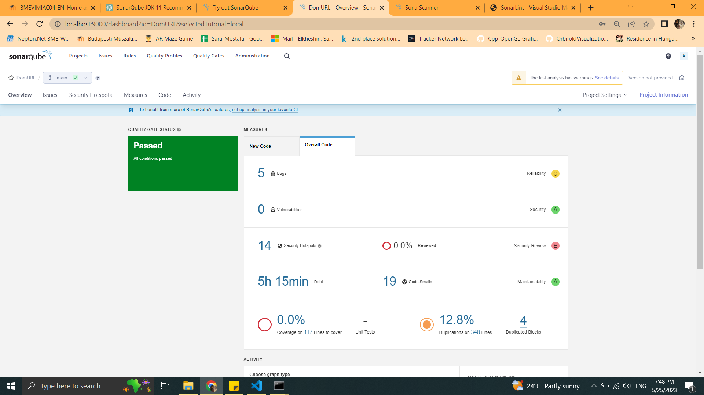
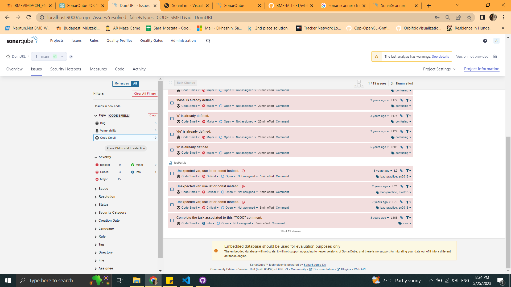
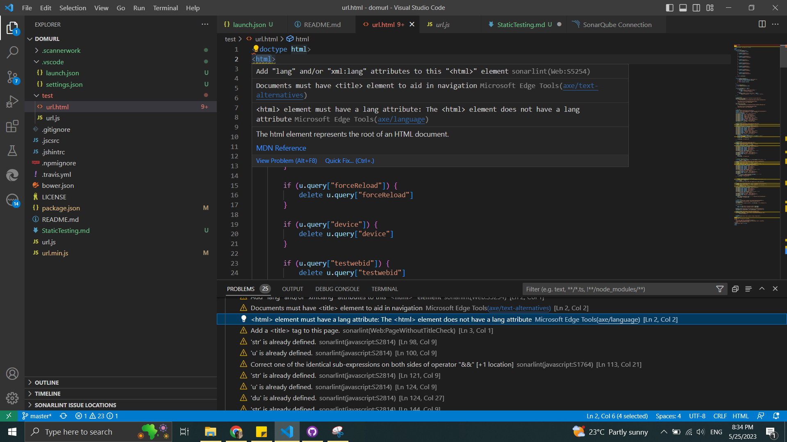
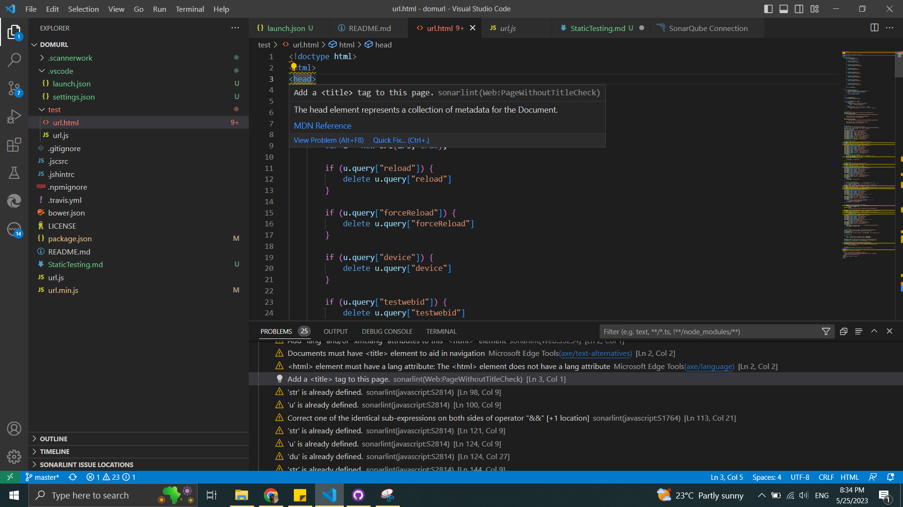
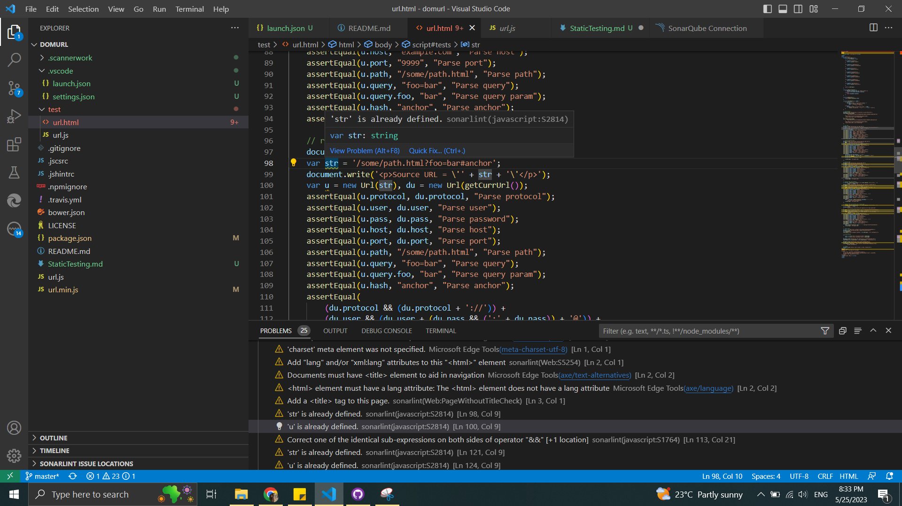

We used SonarQube and Sonalint to perform static testing on the project.
First: we ran sonar scanner cli command in the project's directory and we got the below analysis

One of code smells was found in url.js: if our variable is block-scoped and we don't have to use it later or change it, then it's better to use let

 

Second: I performed analysis with sonarlint to highlight the issues in the file. There are 19 issues found in url.html 

First issue: Adding the lang attribute to your HTML document is important for specifying the language of the content

 

Second issue: The title tag is an essential element in HTML that specifies the title of a webpage

 

Third issue: variable str was declared above

 