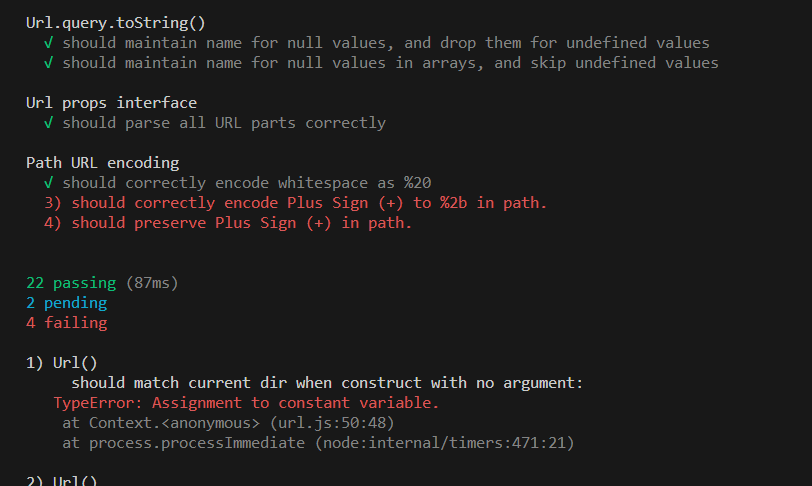

# URL Testing

This repository contains a set of tests for the URL library, which validates the functionality and behavior of the URL module.

## Test Cases

### Url()

- Should construct an object
- Should match the current directory when constructed with no argument
- Should keep the URL without transformations if requested
- Should test absolutize URL
- Should correctly handle URLs with special characters
- Should handle URLs without a protocol
- Should handle URLs with missing components
- Should handle URLs with array query parameters
- Should handle URLs with internationalized domain names

### Url.clearQuery()

- Should remove all variables from the query string

### Url.encode(), Url.decode()

- Should correctly encode and decode query string parameters

### Url.queryLength()

- Should correctly return the length of the query string

### Url.query.toString()

- Should maintain the name for null values and drop them for undefined values
- Should maintain the name for null values in arrays and skip undefined values

### Url props interface

- Should parse all URL parts correctly

### Path URL encoding

- Should correctly encode whitespace as %20
- Should correctly encode Plus Sign (+) to %2b in the path
- Should preserve Plus Sign (+) in the path

## Running the Tests

To run the tests, follow these steps:

1. Install the necessary dependencies (assert, fs, path).
2. Save the test code in a JavaScript file (e.g., `url.test.js`).
3. Make sure the `Url` module is in the correct path.
4. Use a test runner like Mocha to execute the tests.

```bash
$ mocha url.test.js
