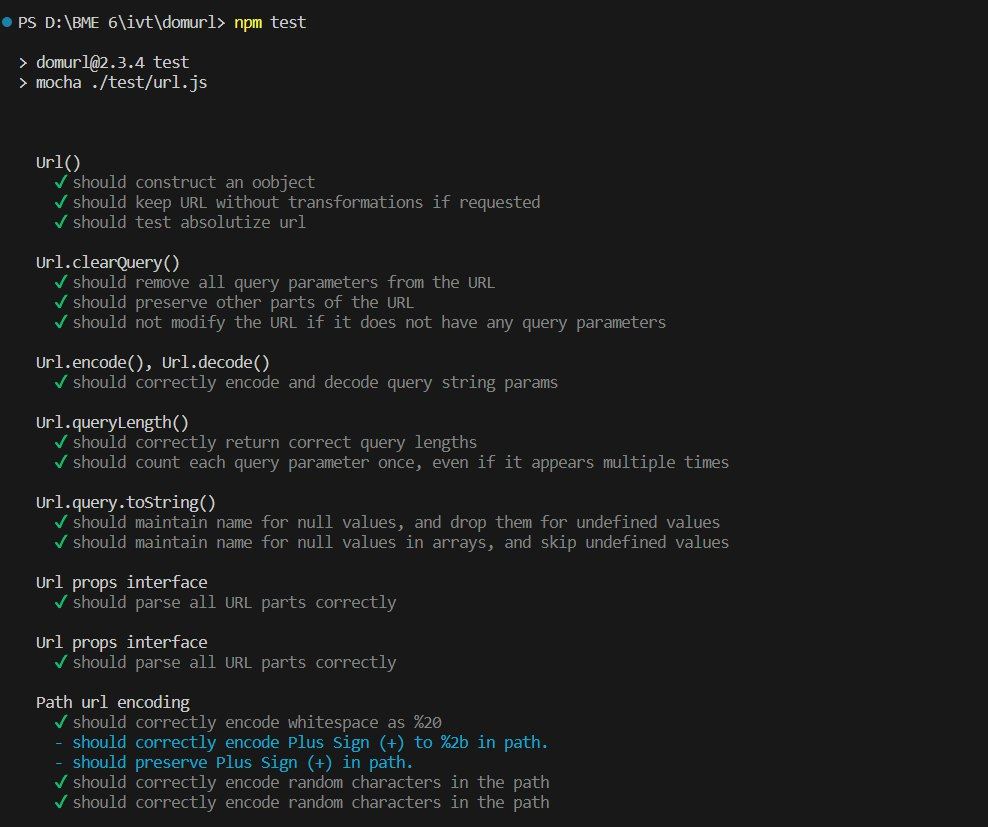
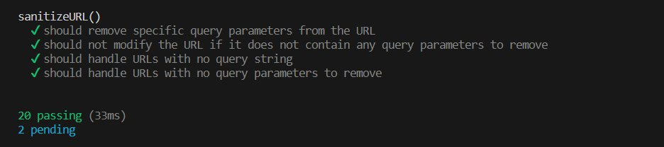

# Testing with Mocha

In our project, we are utilizing the Mocha test framework to run tests for the `url.js` module located in the `/test` directory. Mocha is a popular JavaScript testing framework that provides a simple and flexible way to write and execute tests.

## Mocha Test Framework

Mocha allows us to write test cases using a straightforward syntax, making it easy to define and organize our tests. It provides powerful features such as test suites, test hooks, and assertion libraries, enabling us to thoroughly test our code.

With Mocha, we can structure our tests into logical groups called test suites. Within each suite, we can define individual test cases that verify specific functionality or behavior of our code. Mocha provides various assertion libraries like `assert` to perform assertions and validate the expected results.

## Running Tests for url.js

To test the `url.js` module, we have created a test file called `url.test.js` in the `/test` directory. This file contains multiple test cases written using the Mocha framework. We use the `describe` and `it` functions provided by Mocha to define test suites and test cases, respectively.

The `url.test.js` file contains a collection of test cases that validate different aspects of the `url.js` module. These tests cover scenarios such as URL construction, URL transformation, query string handling, and more.

## Test Execution

To execute the tests, we run the Mocha test runner by executing the `mocha` command in the terminal within the project directory. Mocha will discover the test files and execute them, providing detailed output about the test results.

After running the tests for the `url.js` module, we have obtained successful results. A screenshot of the test execution is shown below:

The screenshot showcases the execution of 20 successful tests, indicating that the functionality implemented in the `url.js` module is working as expected.

With Mocha and the comprehensive test suite, we can confidently ensure the reliability and correctness of the `url.js` module in our project.
